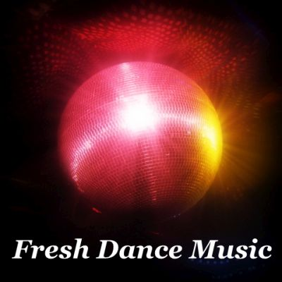

[YouTube](https://www.youtube.com/watch?v=d3tK1HZXAIE&list=PLUY58bai67rbGv9E3z6sDwa3CtIum_2dc&index=2), [Soundcloud](https://soundcloud.com/shivioua/sets/fresh-dance-music-sets), [Mixcloud](https://www.mixcloud.com/shivioua/playlists/fresh-dance-music/), [Spotify](https://open.spotify.com/playlist/5pauzyEbUAAKknivnm52nm)

**Fresh Dance Music Sets by Shivioua**

Welcome to Fresh Dance Music Sets, where Shivioua delivers high-energy DJ mixes full of club, dance, and EDM vibes. Since launching in 2008, Shivioua has been creating unique soundscapes designed to transport listeners straight to the heart of the dancefloor.

With each set, Shivioua takes a fresh approach to blending tracks, focusing on mood and flow to keep listeners energized and immersed. His mixes capture everything from deep grooves to euphoric highs, crafted for dance music enthusiasts who crave dynamic and engaging experiences.

Tune in, turn it up, and let the journey begin! 🎧

# Sets 

* **[Freedom (October 2025)](./freedom-october-2025.md)**
* [New Time, Same Place (August 2021)](./new-time-same-place-august-2021.md)
* [Rzepedka (April 2021)](./rzepedka-april-2021.md)
* [Beachball (July 2018)](./beachball-july-2018.md)
* [Somebody New (November 2015)](./somebody-new-november-2015.md)
* [Cave (January 2015)](./cave-january-2015.md)
* [Deanery No. 161 (May 2014)](./deanery-no-161-may-2014.md)
* [Knockout (March 2011)](./knockout-march-2011.md)
* [House Sweet House (March 2010)](./house-sweet-house-march-2010.md)
* [For An Angel (January 2010)](./for-an-angel-january-2010.md)
* [Primrose (April 2008)](./primrose-april-2008.md)

----

[Other Sets](https://shivioua.github.io)
